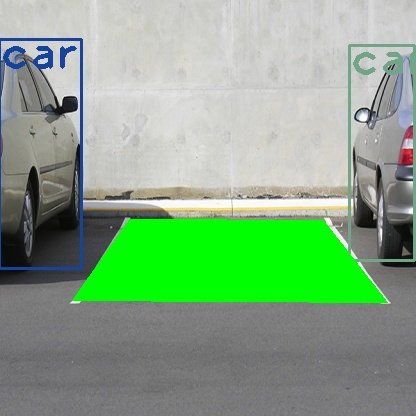

# Parking Spot Detector

> This is a simple implementation and yet from perfect.
 
This project takes several benefit features from Yolo V3 project and OpenCV project.

> Here the accomplishment is to provide a flexible algorithm to detect and show the parking spot and its status. 

### Language
The code is provided in Python 3.

### Darknet
You need to manually download the weights, coco.names and yolov3.cfg 

### Scripts
The main script is called test_park.py
The only needed custom module is called merge.py

### Requirements
I do not write an automated requiremnts.txt for fast virtualenv 
